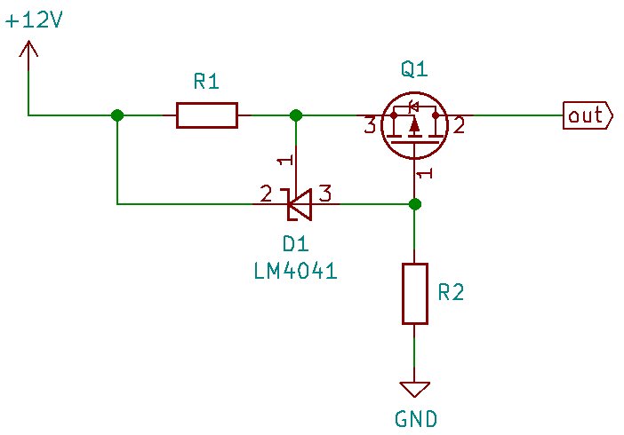

********
Examples
********

Current limiter with LM4041
===========================

Lets calculate the maximum current a current lmiter allows:

The LM4041's cathode-anode (D1) path becomes conductive when the voltage between
the anode and the ref-pin is higher than an internal reference voltage.
This voltage is 1.225V at 0.2% tolerance (B-models) according to the datasheet
(not considering temperature effects right now).
Say R1 is an 8Ω 1% resistor, then the max. current Imax is calculated with:

.. code:: python

   from eecalpy import *

   lm4041_ref = U(1.225, 0.002)  # LM4041 reference voltage
   r1 = R(8, 0.01)  # R1 resistance

   print(f'I_max = {lm4041_ref / r1}')

Running this script gives us:

.. code::

   >>> I_max = 153.14mA ± 1.2% (± 1.84mA) [151.3057 .. 154.9811]mA

